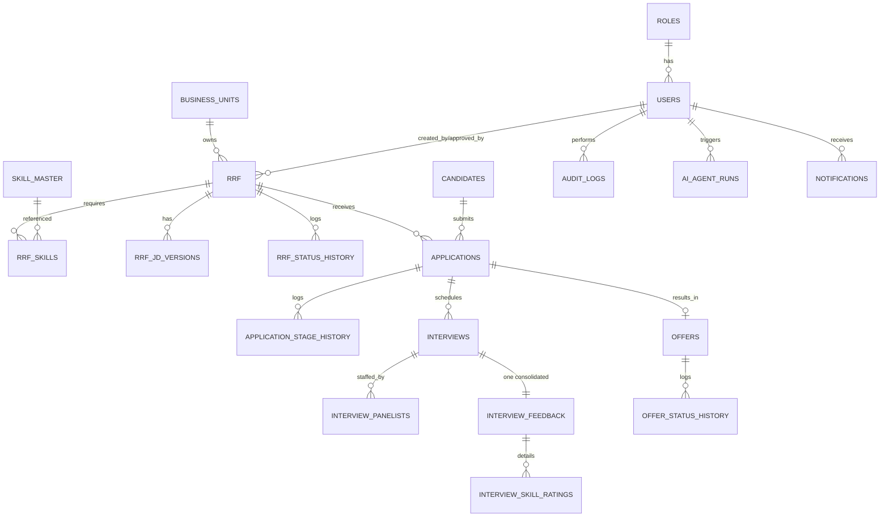

# DATA MODEL — TCG Digital RMS

PostgreSQL, team schema `schema_07` (shared DB `hack_db_02`). Extension-free (T-001): UUID PKs via
built-in `gen_random_uuid()`; case-insensitive email via `UNIQUE INDEX ON (lower(email))` (no CITEXT).
All enums are native PG ENUM types. History/audit tables are append-only. Full DDL: `../RMS_LLD.md` §3.2.

## ER overview

## Enum types
| Enum | Values |
|---|---|
| rrf_status | DRAFT, PENDING_APPROVAL, APPROVED, REJECTED, ON_HOLD, CANCEL_REQUESTED, CANCELLED, CLOSED |
| app_stage | APPLIED, SCREENING, SHORTLISTED, INTERVIEW_R1, INTERVIEW_R2, INTERVIEW_MGMT, OFFER, OFFER_ACCEPTED, JOINED |
| app_status | ACTIVE, ON_HOLD, REJECTED, WITHDRAWN, HIRED |
| stage_action | ADVANCE, REJECT, HOLD, RESUME, WITHDRAW |
| interview_round | R1_TECH, R2_TECH, MANAGEMENT |
| interview_status | SCHEDULED, COMPLETED, CANCELLED, RESCHEDULED, NO_SHOW |
| interview_mode | VIDEO, IN_PERSON, TELEPHONIC |
| recommendation | SELECT, REJECT, HOLD |
| offer_status | DRAFT, RELEASED, ACCEPTED, DECLINED, WITHDRAWN, EXPIRED |
| skill_req_type | ESSENTIAL, DESIRED |
| project_type | T_AND_M, FIXED_FEE |
| agent_run_status | SUCCESS, FAILURE, DEGRADED |

## Tables (data dictionary — key columns)
### Identity & reference
- **roles**(role_id PK, role_code UQ, role_name) — 6 roles: ADMIN, HR, HIRING_MANAGER, BU_HEAD, INTERVIEWER, CANDIDATE.
- **users**(user_id UUID PK, email, password_hash, full_name, role_id FK→roles, designation, is_active, timestamps) — `UNIQUE(lower(email))`.
- **business_units**(bu_id PK, bu_name UQ, bu_head_user_id FK→users).
- **skill_master**(skill_id PK, skill_name UQ, skill_category, aliases JSONB, is_active, imported_at) — INV-09 canonical vocabulary; GIN index on aliases.

### RRF aggregate
- **rrf**(rrf_id UUID PK, rrf_code UQ `RRF-YYYY-NNNN` (internal), job_code UQ `JOB-YYYY-NNNN` (**public** — shown on the careers portal; `rrf_code` is never exposed to candidates/public), position_title, positions_count, assignment_location, base_location, justification, project_name, project_type, needed_by_date, salary_range, wfh_allowed, shift_hours, reporting_to, scope_of_work, responsibilities, education_qualification, min_experience_years, bu_id FK, status rrf_status, created_by FK, hr_rep_user_id FK, approved_by FK, approved_at, held_from_status, positions_filled, timestamps).
- **rrf_skills**(rrf_id FK, skill_id FK, req_type skill_req_type, priority 1..5, PK(rrf_id,skill_id)).
- **rrf_jd_versions**(jd_id PK, rrf_id FK, version_no, jd_markdown, generated_by_agent, created_by, created_at, UQ(rrf_id,version_no)).
- **rrf_status_history**(history_id PK, rrf_id FK, from_status, to_status, comment `CHECK trim>0`, changed_by, changed_at) — append-only.

### Candidate / application aggregate
- **candidates**(candidate_id UUID PK, full_name, email `UNIQUE(lower)`, phone, total_experience_years, current_company, notice_period_days, current_ctc, expected_ctc, source, cv_object_key, cv_file_name, cv_text, parsed_cv JSONB, created_by, created_at).
- **applications**(application_id UUID PK, rrf_id FK, candidate_id FK, current_stage app_stage, status app_status, held_from_stage, ai_screen_score, ai_screen_result JSONB, timestamps, **UQ(rrf_id,candidate_id)** dedupe).
- **application_stage_history**(history_id PK, application_id FK, from_stage, to_stage, action stage_action, comment `CHECK trim>0`, acted_by, acted_at) — append-only.

### Interview aggregate
- **interviews**(interview_id UUID PK, application_id FK, round, scheduled_start/end `CHECK end>start`, mode, meeting_link, location, status, rescheduled_from FK→self, scheduling_agent_run, created_by, created_at, **UQ(application_id,round,status) DEFERRABLE**).
- **interview_panelists**(interview_id FK, user_id FK, is_lead, PK(interview_id,user_id)) — INV-05 size 1..5 (service).
- **interview_feedback**(feedback_id UUID PK, **interview_id UQ** INV-04, overall_rating 1..5, recommendation, strengths, weaknesses, raw_notes, attributes JSONB, ai_summary JSONB, submitted_by, submitted_at).
- **interview_skill_ratings**(feedback_id FK, skill_id FK, rating 1..5, remarks, PK(feedback_id,skill_id)).

### Offer aggregate
- **offers**(offer_id UUID PK, **application_id UQ**, offer_code UQ `OFR-YYYY-NNNN`, designation, ctc_annual, joining_date, work_location, letter_object_key, status offer_status, valid_until, generated_by, released_at, responded_at, created_at).
- **offer_status_history**(history_id PK, offer_id FK, from_status, to_status, comment `CHECK trim>0`, changed_by, changed_at) — append-only.

### Cross-cutting
- **audit_logs**(audit_id PK, entity_type, entity_id, action, performed_by FK, before_state JSONB, after_state JSONB, created_at) — INV-02 append-only ledger.
- **ai_agent_runs**(run_id UUID PK, agent_name, entity_type, entity_id, model, input_digest JSONB, output JSONB, prompt_tokens, completion_tokens, latency_ms, status agent_run_status, error_detail, triggered_by, created_at) — INV-12.
- **notifications**(notification_id PK, user_id FK, title, body, link_path, is_read, created_at) — in-app only.

## Normalization
3NF; lookups (roles, skill_master, business_units) and M:N junctions (rrf_skills,
interview_panelists, interview_skill_ratings). Controlled denormalization:
`applications.ai_screen_*` (read-hot agent output; source of truth in `ai_agent_runs`) and
`candidates.cv_text` (extraction cache). History tables never receive UPDATE/DELETE.

## Object storage (MinIO, single bucket `bucket-07` — ADR-003)
- `cvs/{yyyy}/{mm}/{candidate_id}_{name}` — candidate CVs (private)
- `offers/{yyyy}/{offer_code}.{pdf|html}` — generated offer letters
- `templates/offer_template_v1.html` — fixed offer template (INV-10)
