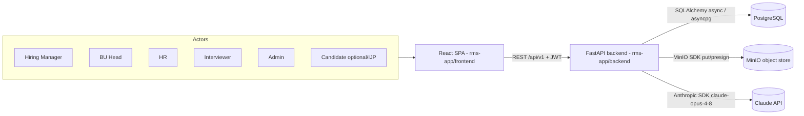
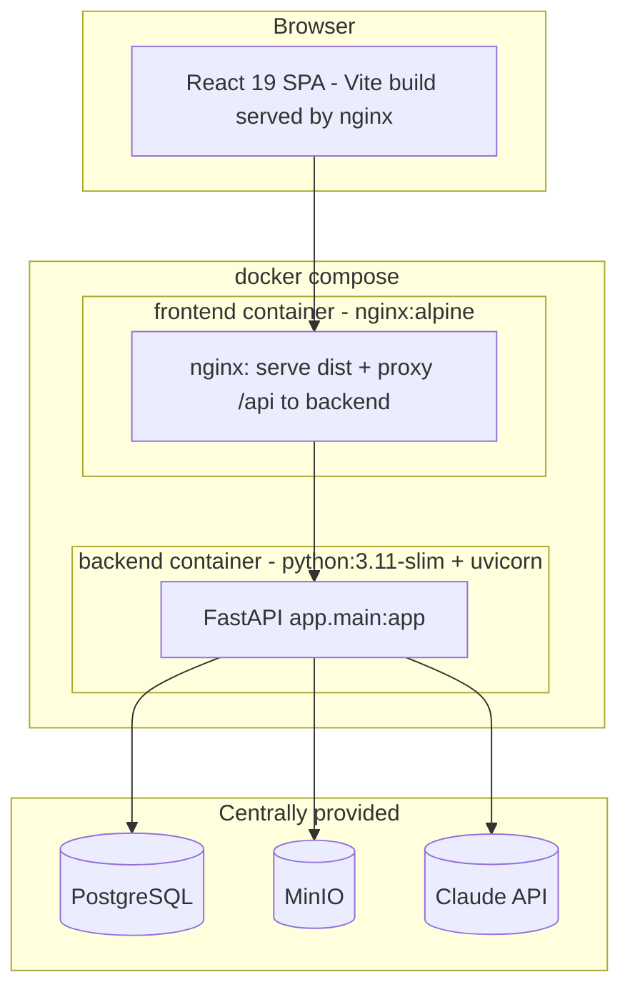
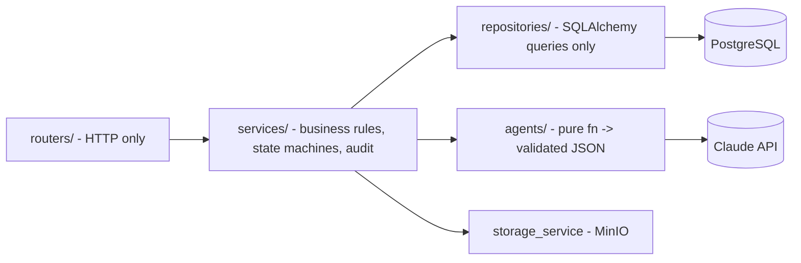
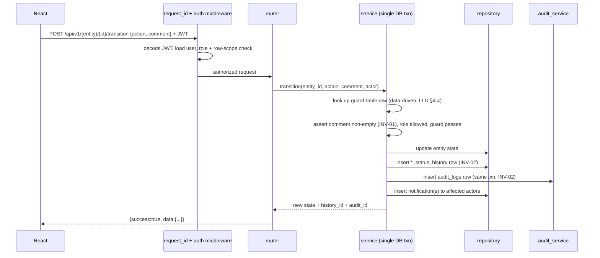
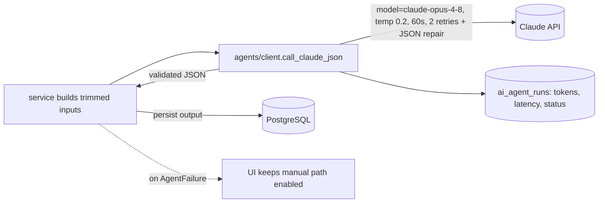
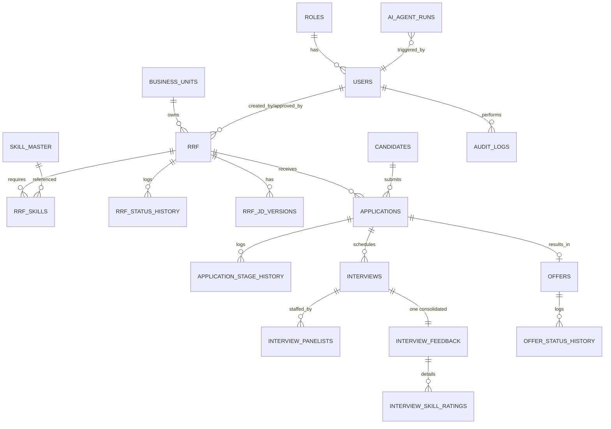
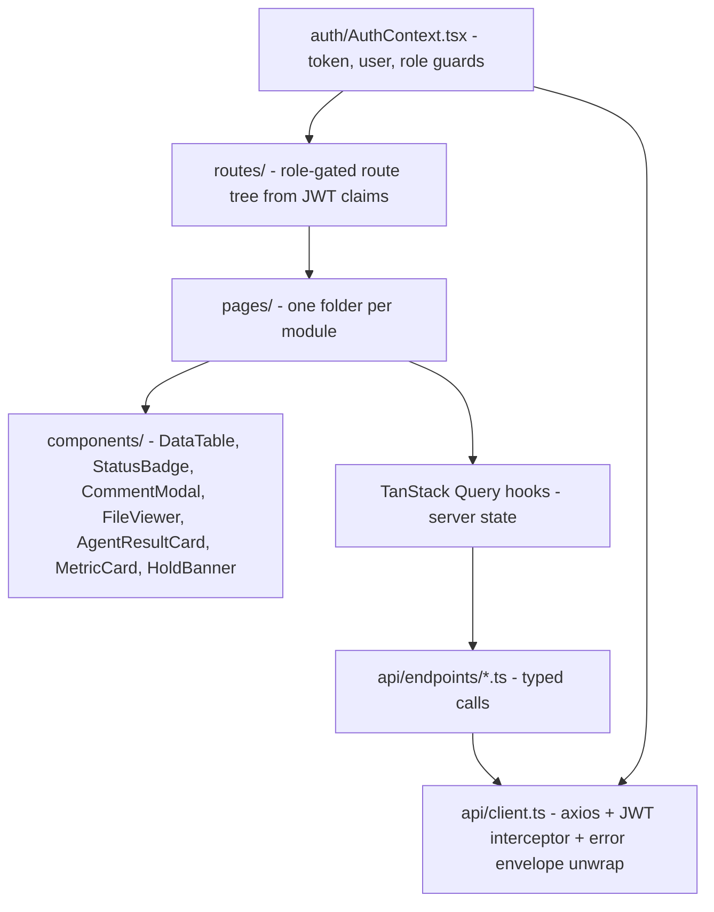

# ARCHITECTURE — TCG Digital RMS (`rms-app`)

```yaml
document: architecture
version: 1.0
scope: HLA + component architecture for database, backend (Python), and UI
source_of_truth: ../RMS_LLD.md      # design decisions live there; this doc synthesizes + operationalizes
agent_context: ../CLAUDE.md
task_order: ../plan.md
stack_locked:
  frontend: React 19.1.1 + Vite + TypeScript + TanStack Query + axios (nginx-served in Docker)
  backend:  Python 3.11 + FastAPI (async) + SQLAlchemy 2.0 + Alembic + Pydantic v2
  database: PostgreSQL (centrally provided, SHARED DB hack_db_02; team schema schema_07 — ADR-004)
  storage:  MinIO (single provided bucket bucket-07; prefixes cvs/ offers/ templates/ — ADR-003)
  ai:       Anthropic SDK, model "claude-opus-4-8" only
  runtime:  Docker Compose (backend + frontend)
```

> This document is the High-Level Architecture (HLA) deliverable (plan.md T-405). It does **not**
> re-decide anything settled in the LLD; it explains **how the pieces fit** and records any
> architecture decisions (ADRs) that arise during the build. Enum names, table names, and endpoint
> contracts are frozen in the LLD — changing them requires an ADR in §7 below.

---

## 1. SYSTEM CONTEXT (C4 Level 1)



**Trust boundary:** the browser never talks to PostgreSQL, MinIO, or Claude directly. All access is
mediated by FastAPI, which enforces authN (JWT), authZ (RBAC + row-scope), validation, and audit.
Files are uploaded server-side (never presigned PUT from browser) and downloaded via short-lived
(15 min) presigned GET URLs gated by entity-level RBAC.

---

## 2. CONTAINER ARCHITECTURE (C4 Level 2)



- **frontend**: multi-stage Docker (node:20 build → nginx serve). nginx reverse-proxies `/api/*`
  to backend so the SPA uses same-origin calls (no CORS in prod-like path; CORS still allowlisted
  for local `vite dev`).
- **backend**: single uvicorn process. Startup command: `alembic upgrade head && python -m app.db.seed && uvicorn app.main:app`.
- **external infra** is switched purely via env (`DATABASE_URL`, `MINIO_ENDPOINT`). A `local-infra`
  compose profile (postgres:16 + minio) is the **fallback only** when central instances are down (R2).

---

## 3. BACKEND ARCHITECTURE (Python / FastAPI)

### 3.1 Strict layering (enforced — see LLD §2.3)



| Layer | May do | May NOT do |
|---|---|---|
| `routers/` | parse/validate request, call one service, return envelope | SQL, business rules, cross-service orchestration |
| `services/` | transactions, guard-table transitions, agent triggers, write history+audit+notifications | direct HTTP concerns, raw SQL strings |
| `repositories/` | SQLAlchemy queries incl. row-scope filters (owner/bu/panelist) | business decisions, transitions |
| `agents/` | build prompt, call Claude, validate JSON, log `ai_agent_runs` | write domain tables (service persists), block manual flow on failure |

### 3.2 Module map (from LLD §2.1)

```text
backend/app/
  main.py            app factory: CORS, routers, exception handlers, request_id middleware
  core/              config (pydantic-settings), security (JWT/bcrypt), deps (get_db/current_user/require_roles), errors (AppError hierarchy)
  db/                session (async engine + sessionmaker), seed (roles, admin, demo users, BU, template upload, skill import)
  models/            SQLAlchemy models, 1 file per aggregate (user, rrf, candidate, application, interview, offer, skill, audit, agent_run)
  schemas/           Pydantic v2 request/response mirroring models
  repositories/      DB access per aggregate
  services/          auth, rrf, pipeline, interview, offer, dashboard, skill, storage(MinIO), audit
  agents/            client (shared wrapper) + 5 mandatory agents (+ optional)
  routers/           auth, users, rrfs, candidates, applications, interviews, offers, skills, dashboard, agents, files, health
  utils/             pagination, cv_text_extract (pdf/docx), pdf_render (Jinja2+WeasyPrint)
  alembic/           single migration = full DDL (LLD §3.2)
  tests/             pytest smoke per router + guard-table matrix
```

### 3.3 Request lifecycle (write path with transition)



### 3.4 The transition guard table (central design element)

All state transitions (RRF G1–G5, Application G6–G14, Interview G15, Offer G16–G17) route through a
**single data-driven guard table** (a Python dict/registry), never scattered `if` branches. Each entry:
`(entity, from_state, action) -> {to_state, allowed_roles, guard_fn}`. This is what makes INV-01/02/03
and the RBAC matrix testable as a matrix (pytest over the table) rather than per-endpoint.

Key invariants realized here: **INV-01** (comment mandatory, also a DB `CHECK`), **INV-02** (history +
audit in one txn), **INV-03** (HOLD sets `held_from_*`; RESUME returns to it), **INV-07** (BU_HEAD guard
rows exist only for RRF approve/reject/cancel/hold), **INV-08** (HM cancel → `CANCEL_REQUESTED` → BU_HEAD confirm).

### 3.5 AI agent subsystem



Five mandatory agents (LLD §6.2–6.6): `resume_screening`, `jd_creation`, `candidate_matching`,
`interview_scheduling`, `feedback_summarization`. Shared wrapper rules: temperature 0.2, 60s timeout,
2 retries with backoff, one JSON-repair pass, **always** log `ai_agent_runs` (INV-12), inputs trimmed
(cv_text ≤ 12k chars). Agents are **advisory** — failure never blocks the manual workflow. INV-06 is
enforced server-side for `feedback_summarization`: prior-round summaries are injected by the service;
the requester can never supply them.

### 3.6 Cross-cutting concerns

```yaml
authN:   JWT HS256, exp 8h, bcrypt(12); /auth/login and /health public, all else Bearer
authZ:   deps.require_roles(...) + repository row-scoping (owner_id / bu_id / panelist join)
errors:  AppError hierarchy -> FastAPI exception handlers -> error envelope (RMS-E-* codes, LLD §5.1)
logging: structlog JSON to stdout {ts, level, request_id, user_id, path, latency_ms}
pagination: INV-11 on every list (default 20, max 100); cv_text excluded from list payloads
config:  pydantic-settings from env only; .env gitignored, .env.example committed (no values)
```

---

## 4. DATABASE ARCHITECTURE (PostgreSQL)

### 4.1 Aggregates & ER (from LLD §3.1)



### 4.2 Design principles (operationalized from LLD §3.2/§3.3)

```yaml
schema_source: single Alembic migration = full DDL in LLD §3.2 (do not hand-edit tables afterwards)
extensions_first: CREATE EXTENSION citext; CREATE EXTENSION pgcrypto;  (before any table)
enums: 12 PG ENUM types (rrf_status, app_stage, app_status, stage_action, interview_round,
       interview_status, interview_mode, recommendation, offer_status, skill_req_type,
       project_type, agent_run_status) — frozen; renaming requires an ADR
normalization: 3NF; M:N resolved via junctions (rrf_skills, interview_panelists, interview_skill_ratings)
controlled_denormalization:
  - applications.ai_screen_score / ai_screen_result  (read-hot cache; source of truth = ai_agent_runs)
  - candidates.cv_text                                (extraction cache; avoid re-parsing per agent call)
append_only_tables: rrf_status_history, application_stage_history, offer_status_history,
                    audit_logs  --> application code NEVER issues UPDATE/DELETE on these
constraints_enforce_invariants:
  - INV-01: history.comment CHECK length(trim(comment)) > 0
  - INV-04: interview_feedback.interview_id UNIQUE
  - INV-05: panel size 1..5 enforced in service (interview_panelists count)
  - dup guard: applications UNIQUE (rrf_id, candidate_id)
  - one live interview per round: interviews UNIQUE (application_id, round, status) DEFERRABLE
indexes: status/stage/bu/created_by, panelist_user, audit(entity_type,entity_id,created_at),
         agent_runs(entity / name), skill aliases GIN
```

### 4.3 Data lifecycle notes

- **Seed (idempotent)**: 6 roles, 1 admin, one demo user per role (creds printed to seed output),
  1 business unit (head = BU user), upload `offer_template_v1.html` to `rms-templates`, import Skill
  Master xlsx from `./seed_data/` if present (INV-09).
- **History vs audit**: entity-specific `*_status_history` gives a per-entity timeline; `audit_logs`
  is the global append-only ledger (before/after JSONB). Both written in the same transaction as the
  state change.
- **Object keys** (MinIO — single provided bucket `bucket-07`, ADR-003): prefixes replace the LLD's
  three buckets — `cvs/{yyyy}/{mm}/{candidate_id}_{name}`, `offers/{yyyy}/{offer_code}.pdf`,
  `templates/offer_template_v1.html`. Bucket name comes from env (`MINIO_BUCKET`); backend must NOT
  attempt bucket creation (no permission on shared MinIO) — only key-prefix ensure.
- **Schema scoping** (shared PG `hack_db_02`, ADR-004 — **confirmed by T-001**): all tables/enums
  live in `schema_07` (from env `PG_SCHEMA`); engine sets `search_path`. Verified on **PG 16.14**:
  `gen_random_uuid()` is built-in (no pgcrypto), `team_07` has DDL rights in `schema_07`, but
  **`CREATE EXTENSION` is denied** — so the migration is **extension-free** and email/name columns
  use `VARCHAR + UNIQUE INDEX ON (lower(col))` instead of CITEXT.

---

## 5. FRONTEND ARCHITECTURE (React 19 + Vite + TypeScript)

### 5.1 Layering



### 5.2 Structure (from LLD §2.2)

```text
frontend/src/
  api/client.ts            axios instance, Bearer interceptor, envelope/error normalization
  api/endpoints/*.ts       typed calls per router (auth, rrfs, candidates, applications, interviews, offers, skills, dashboard, files, agents)
  auth/AuthContext.tsx     token + user + role guards (source of truth for UI gating)
  routes/index.tsx         role-gated routes (hide AND rely on server enforcement)
  pages/                   Login, Dashboard, rrf/, candidates/, pipeline/, interviews/, offers/, admin/
  components/              DataTable(paginated), StatusBadge, CommentModal, FileViewer, AgentResultCard, MetricCard, HoldBanner
  store/                   TanStack Query config (server state; no extra state libs)
```

### 5.3 UI principles ("child-level easy UI + enterprise backend")

```yaml
state_management: TanStack Query for ALL server state + React context for auth only (no Redux/Zustand)
transitions: CommentModal is the ONLY way to fire any transition; comment required client + server (INV-01)
pipeline: kanban board grouped by app_stage; HoldBanner with resume on held items (INV-03)
agents: AgentResultCard renders agent output + "run / re-run" button; never a dead control
files: CV & offer-letter viewing strictly via presigned URLs from GET /files/presign
rbac: routes + controls hidden by JWT role, but server is the real gate (RBAC matrix LLD §7.1)
no_dummy_controls: if a control renders, it calls a real endpoint (hackathon acceptance rule)
lists: every list uses the paginated DataTable (INV-11)
```

### 5.4 Key data-flow: an AI-backed action (e.g. resume screening)

```mermaid
sequenceDiagram
  participant U as User (HR)
  participant Q as TanStack Query mutation
  participant BE as FastAPI
  U->>Q: click "Screen (AI)" on candidate detail
  Q->>BE: POST /applications/{id}/screen
  BE-->>Q: {success:true, data: screening result} OR {error: RMS-E-5021}
  Q->>Q: invalidate application + pipeline queries
  Q-->>U: AgentResultCard shows score/coverage; on failure, toast + manual buttons stay enabled
```

---

## 6. DEPLOYMENT VIEW (Docker Compose)

```yaml
services:
  backend:
    build: ./backend            # python:3.11-slim (+ libpango/cairo for WeasyPrint)
    command: alembic upgrade head && python -m app.db.seed && uvicorn app.main:app --host 0.0.0.0 --port 8000
    env_file: .env              # -> provided PostgreSQL + MinIO + Claude
    ports: ["8000:8000"]
    healthcheck: GET /health    # db + minio ping
  frontend:
    build: ./frontend           # node:20 build -> nginx:alpine serve dist; proxy /api -> backend
    ports: ["3000:80"]
    depends_on: [backend]
profiles:
  local-infra: postgres:16 + minio (fallback only; switch via env, not code)
mcube: integration deferred (design-for-future only); documented for the mCube plan Q&A (plan.md §5)
```

---

## 7. ARCHITECTURE DECISION RECORDS (ADRs)

> Append an ADR here whenever an implementation choice deviates from or extends the LLD
> (esp. any enum/table-name change per CLAUDE.md §10). Format: ID · date · context · decision · consequence.

| ID | Date | Decision | Status |
|---|---|---|---|
| ADR-000 | 2026-07-09 | Adopt LLD §3.2 DDL verbatim as the single Alembic migration; no schema drift without a new ADR. | Accepted |
| ADR-001 | 2026-07-09 | Frontend in **TypeScript** (matches LLD `.ts/.tsx` layout + CLAUDE.md §8 preference). | Accepted |
| ADR-002 | 2026-07-09 | Transitions implemented as a **single data-driven guard table**, not per-endpoint conditionals. | Accepted |
| ADR-003 | 2026-07-09 | Hackathon provides ONE MinIO bucket (`bucket-07`), not three. LLD §8 buckets become **key prefixes** (`cvs/`, `offers/`, `templates/`) inside `MINIO_BUCKET` from env. No bucket creation by backend. | Accepted |
| ADR-004 | 2026-07-09 | Shared PG DB `hack_db_02` with team schema `schema_07` (env `PG_SCHEMA`, engine `search_path`). **T-001 confirmed on PG 16.14:** `CREATE EXTENSION` is denied → migration is extension-free; use built-in `gen_random_uuid()` (no pgcrypto) and `VARCHAR + UNIQUE INDEX ON lower(col)` in place of CITEXT. | Accepted (verified) |
| ADR-005 | 2026-07-09 | Submission repo MUST be named `submission` under GitLab subgroup `hackathon/team-07`; **only `main` branch is evaluated** and must pass the organizer verification script; repo archived at deadline. VPN (FortiClient) required for GitLab/PG/MinIO. | Accepted |
| ADR-006 | 2026-07-09 | **T-107 live finding:** `claude-opus-4-8` **rejects the `temperature` parameter** (HTTP 400 "temperature is deprecated for this model"), contradicting LLD §6.1. The `call_claude_json` wrapper keeps `temperature` in its signature for interface stability but does NOT send it. All agents (T-203/206/302/304/305) must rely on the wrapper and never pass temperature to the API directly. Determinism now comes from strict prompts + JSON-only + schema validation, not a temperature knob. | Accepted (verified) |

---

## 8. INVARIANT → ARCHITECTURE TRACEABILITY

| Invariant | Where enforced in this architecture |
|---|---|
| INV-01 comment required | guard table (§3.4) + DB CHECK on history tables (§4.2) + CommentModal (§5.3) |
| INV-02 history + audit | service txn writes both rows (§3.3) |
| INV-03 hold/resume anywhere | `held_from_*` columns + guard table G5/G14 |
| INV-04 one feedback/interview | `interview_feedback.interview_id` UNIQUE (§4.2) |
| INV-05 panel 1..5 | interview_service validation (§3.1) |
| INV-06 prior-feedback scope | server injects prior summaries; endpoint scopes rounds < current (§3.5) |
| INV-07 BU_HEAD limits | guard rows + require_roles + row-scope (§3.4, §3.6) |
| INV-08 HM cancel two-step | CANCEL_REQUESTED → BU_HEAD confirm (§3.4) |
| INV-09 skill master canonical | FK to `skill_master`; xlsx import in seed (§4.3) |
| INV-10 fixed offer template | Jinja2 fill of fixed template → WeasyPrint PDF → MinIO (§4.3, §6) |
| INV-11 pagination | paginated DataTable + repository pagination (§3.6, §5.3) |
| INV-12 agent logging | `agents/client` always writes `ai_agent_runs` (§3.5) |

## 9. POST-PHASE-1 ENHANCEMENTS

Additions layered on the Phase-1 core, following the same layering/invariant rules.

### 9.1 Candidate career portal & self-service (`careers` module)
A public careers site plus candidate self-service, integrated into the real ATS pipeline.
- **Router** `routers/careers.py`, **service** `services/careers_service.py`.
- **Auth model — reuse `users` + JWT (no new table):** signup creates a `CANDIDATE` user (email + bcrypt password) **and** a linked `candidates` profile (with CV upload → MinIO + text extract), matched by `lower(email)`. All existing JWT/`get_current_user` plumbing is reused; `require_roles("CANDIDATE")` gates candidate-only endpoints.
- **Applying flows into the real pipeline:** `POST /careers/apply` calls `pipeline_service.create_application`, so a portal application appears in HR's Pipeline, is deduped, and is auto-screened by AGENT-1 — no parallel data path.
- **Endpoints:** `GET /careers/jobs` (public), `POST /careers/signup` (public, multipart), `POST /careers/apply` (CANDIDATE), `GET /careers/me` (CANDIDATE — applications with stage/status, scheduled interviews incl. join link, released/accepted offer + presigned letter URL).
- **Frontend:** routes outside `AppShell` — `/careers` (public portal), `/careers/login`, `/careers/signup`, `/careers/dashboard` (CandidateGuard). Staff `AppShell` and login redirect a `CANDIDATE` to `/careers/dashboard`. Auth screens share `components/brand.tsx` (`BrandPanel`/`CareersBrandPanel`) and the `.auth-split` design translated from `mockups/login.html` + `mockups/career-portal.html`.

### 9.2 Public vs internal requisition identity
`rrf.job_code` (`JOB-YYYY-NNNN`, UNIQUE) is a **public** job id generated at RRF creation and stored in the DB; the internal `rrf_code` (`RRF-YYYY-NNNN`) is **never** exposed on public/candidate surfaces. Careers responses emit only `job_code`; internal RRF detail emits both. (Existing rows backfilled once.)

### 9.3 Employee directory & interview scheduling UI
`routers/users.py` exposes `GET /users` (directory, panelist pool), `GET /users/roles`, `POST /users`, `PATCH /users/{id}` (admin employee management). This unblocks the interview-scheduling UI (`ScheduleInterviewModal`) — HR picks a 1–5 panel with one lead (INV-05) from the live directory; panelists are notified on save.

### 9.4 UX enhancements (frontend-only unless noted)
- **Pipeline:** drag-a-card-to-next-stage (routes through the mandatory CommentModal → real transition), cards ranked by AI screen score (desc) within each column, per-card AI-assessment modal (`GET /applications/{id}` full result), inline "Schedule interview".
- **Skill Master:** in-UI add/edit skills (`POST`/`PATCH /skills`).
- **Offers console:** offer-status column (Draft / **Offer shared** / Accepted / Declined) via `GET /offers`.
- **Command Center:** clickable KPI cards (role-aware deep links) + time-of-day greeting.
- **Global background-activity indicator** (TanStack `useIsMutating`/`useIsFetching`) in the topbar; collapsible sidebar can re-expand.

*End of architecture.md.*
